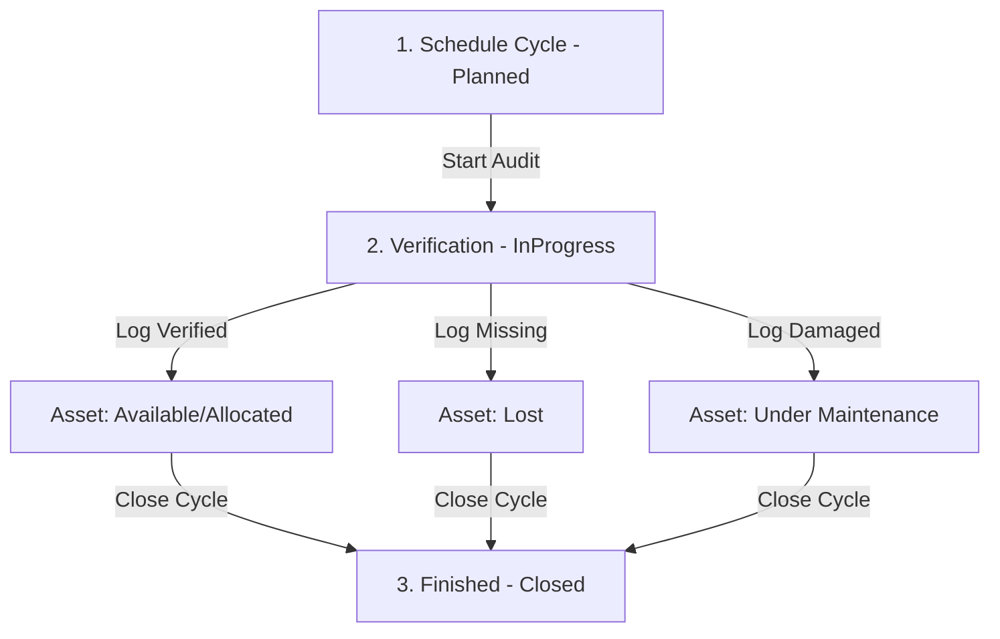

# Asset Audit & Reconciliation Flow

This document explains the features, database models, and API logic of the **Asset Audit & Reconciliation** system implemented in this application.

---

## 1. What is Asset Auditing?
Asset Auditing is a compliance and control feature used to verify that the physical assets recorded in the database match reality. It tracks whether devices are present, lost, or need repair.

---

## 2. The 4-Step Audit Lifecycle

### Step 1: Schedule Cycle (`Planned` Status)
* **Scope Definition**: Managers schedule an audit window (`startDate` and `endDate`) and specify an optional scope:
  * **Department Scope**: Audit only assets currently issued/allocated to a particular department.
  * **Location Scope**: Audit only assets physically stored at a particular office/lab.
* **Auditor Assignment**: Managers check off employee names to assign them as the official auditors.

### Step 2: Start Audit (`InProgress` Status)
* **Activation**: The manager starts the audit. This opens up the **Physical Verification Desk** where auditors log findings.

### Step 3: Log Physical Findings
* **Verification Desk**: The assigned auditor goes through the list of assets in scope and marks one of three physical check results:
  1. **`Verified`**: The asset is present and working.
  2. **`Missing`**: The asset is missing. The system **instantly reconciles** this, updating the asset's status to `Lost` in the main registry.
  3. **`Damaged`**: The asset is broken. The system **instantly reconciles** this, changing the asset's status to `Under_Maintenance`.
* **Auditor Notes**: Custom condition observations can be typed (e.g. *"Dented chassis, otherwise functioning"*).

### Step 4: Close Cycle (`Closed` Status)
* **Closure**: The manager closes the cycle. The database locks all findings, records the `closedAt` timestamp, and finalizes reconciliation.

---

## 3. Database Schema

The feature leverages the following tables inside `backend/prisma/schema.prisma`:

* **`AuditCycle`**: Stores scope rules (department/location), date range, status, and closed timestamp.
* **`AuditAssignment`**: Stores link between `AuditCycle` and the auditor `User`.
* **`AuditFinding`**: Records the verified check result (`Verified`, `Missing`, `Damaged`) and condition notes for each asset.

---

## 4. API Endpoints Mounted at `/api/audits`

* **`GET /api/audits/cycles`**: Fetch cycles with related scope department, auditors, and logged findings.
* **`POST /api/audits/cycles`**: Create cycle and batch insert assignments in a transaction.
* **`POST /api/audits/cycles/:id/start`**: Start cycle (change status to `InProgress`).
* **`POST /api/audits/cycles/:id/findings`**: Create/update `AuditFinding` for an asset and trigger immediate status reconciliation.
* **`POST /api/audits/cycles/:id/close`**: Close cycle (set status to `Closed`, write `closedAt` timestamp).
